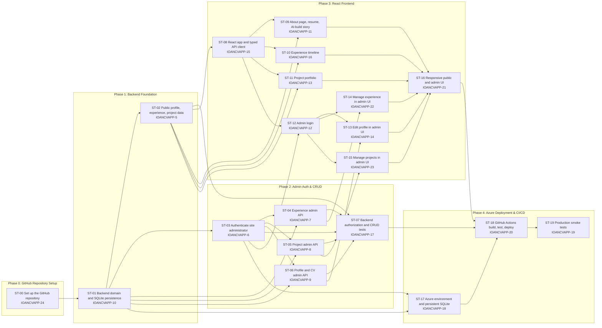

# PRD: Ioan CV & Portfolio Site

## 1. Executive Summary

Ioan CV & Portfolio Site is a personal portfolio web application that showcases Ioan's professional background (CV/experience) and project work, while doubling as a live demonstration piece: the application itself is built with the help of AI coding tools (Claude Code), and that story is part of the showcase. The system is a classic two-tier web app — an ASP.NET Core Web API backend and a React single-page frontend — with an authenticated admin area so Ioan can update his CV and project entries without redeploying code.

The core value proposition is twofold: (1) give visitors — recruiters, hiring managers, collaborators — a fast, credible view of Ioan's experience and project portfolio, and (2) let the site itself serve as evidence of Ioan's ability to design, build, and ship a full-stack application using modern AI-assisted development practices.

The MVP goal is a deployed, publicly reachable site with an About/CV page, an Experience section, and a Projects portfolio, backed by a database-driven admin panel for content management, running entirely on free-tier Azure and GitHub services at zero hosting cost.

## 2. Mission

**Mission statement:** Give Ioan a professional, low-maintenance web presence that presents his experience and project work clearly, and that itself demonstrates his skill in building production-quality software with AI-assisted workflows.

**Core principles:**
- **Content over chrome** — the CV and project data must be easy to read and easy to update; visual polish supports that, it doesn't replace it.
- **Editable without redeploying** — Ioan should never need to touch code or CI to fix a typo in his bio or add a new project.
- **Small, real, deployable** — MVP scope stays small enough to actually ship and run on Azure, rather than accumulating unshipped features.
- **The build is part of the pitch** — the fact that this was built with AI tooling is a feature to surface, not hide.
- **Secure by default for the one thing that matters** — admin write access is properly authenticated even though the public site has no user accounts.

## 3. Target Users

**Primary persona: Recruiters / hiring managers / technical interviewers**
- Technical comfort level: ranges from non-technical (HR) to highly technical (engineering leads).
- Needs: quickly assess Ioan's experience, skills, and relevant project work; find contact/links (LinkedIn, resume PDF) without friction.
- Pain points: portfolio sites that are slow, cluttered, or bury the actual CV content behind animations/marketing copy.

**Secondary persona: Ioan (site owner/admin)**
- Technical comfort level: full-stack developer, comfortable with .NET and React, using Claude Code as a build partner.
- Needs: a simple authenticated admin UI to add/edit/remove experience entries and projects; confidence that the admin area is not publicly writable.
- Pain points: not wanting to redeploy or touch a database directly just to update content.

**Secondary persona: Fellow developers / AI-tooling-curious visitors**
- Technical comfort level: high.
- Needs: interested in how the site was built (stack, architecture, AI-assisted process).
- Pain points: portfolio sites that make vague claims about "using AI" with no substance.

## 4. MVP Scope

### In Scope

**Core Functionality**
- [ ] Public About/CV page (bio, skills, contact links)
- [ ] Public Experience section (work history entries: title, company, dates, description)
- [ ] Public Projects portfolio (project cards: name, description, tech stack)
- [ ] Short "Built with AI" section describing the ASP.NET + React stack and the AI-assisted build process (static content)
- [ ] Admin login (single admin account, Ioan)
- [ ] Admin CRUD UI for Experience entries
- [ ] Admin CRUD UI for Projects entries
- [ ] Admin edit for the About/CV bio content

**Technical**
- [ ] ASP.NET Core Web API backend with EF Core + relational database
- [ ] React (TypeScript) frontend consuming the API
- [ ] JWT-based authentication scoped to admin-only write endpoints
- [ ] Public read endpoints require no authentication
- [ ] Responsive layout (desktop + mobile)

**Integration**
- [ ] Links out to LinkedIn and downloadable resume (PDF)

**Deployment**
- [ ] Deployed to Azure (API + database + frontend hosting), using only free-tier services
- [ ] Basic CI pipeline (build + deploy on push to main)

### Out of Scope (Future Phases)

- [ ] AI-tailored resume/job-fit summary generator
- [ ] Internationalization / multi-language content

## 5. User Stories

1. As a recruiter, I want to see Ioan's work experience at a glance, so that I can quickly judge fit for a role without reading a PDF.
   - Example: Landing on `/experience` shows a reverse-chronological list of roles with company, title, dates, and a 2-3 sentence summary each.

2. As a recruiter, I want to browse Ioan's projects with descriptions and tech stacks, so that I can evaluate the breadth and type of work.
   - Example: `/projects` shows a grid of project cards with name, description, and technology tags.

3. As a visitor, I want to download Ioan's resume as a PDF, so that I can share it internally or attach it to an ATS.
   - Example: A "Download Resume" button on the About page fetches a static PDF asset.

4. As a technical visitor, I want to understand how this site was built and with what AI tooling, so that I can evaluate Ioan's engineering process.
   - Example: A short "Built with AI" section states the stack (ASP.NET Core + React) and describes the AI-assisted build process at a high level.

5. As Ioan (admin), I want to log into a protected admin area, so that only I can modify site content.
   - Example: Visiting `/admin` redirects to a login form; valid credentials issue a JWT stored client-side for subsequent authenticated requests.

6. As Ioan (admin), I want to add, edit, and delete project entries, so that my portfolio stays current without a code change.
   - Example: In `/admin/projects`, I fill a form (name, description, tech stack, links) and save; the change appears on the public `/projects` page immediately.

7. As Ioan (admin), I want to edit my bio and experience entries, so that I can keep my CV accurate as my career progresses.
   - Example: In `/admin/experience`, I edit an existing role's end date and description and save.

8. As a mobile visitor, I want the site to be readable and navigable on my phone, so that I can review Ioan's portfolio from any device.
   - Example: Layout reflows to a single column, nav collapses to a hamburger menu, tap targets are appropriately sized.

**Technical user story**
9. As the system, I want write endpoints to reject unauthenticated requests, so that only Ioan can modify content even if the frontend admin route is somehow bypassed.
   - Example: A `POST /api/projects` call without a valid JWT returns `401 Unauthorized`.

## 6. Core Architecture & Patterns

**High-level approach:** A decoupled SPA + REST API architecture. React frontend is a static build served independently (Azure Static Web Apps Free tier); ASP.NET Core Web API is a stateless service backed by a SQLite database file on persistent storage, deployed to Azure App Service's Free (F1) tier. The two communicate exclusively over HTTPS/JSON.

**Backend directory structure (indicative):**
```
/backend
  /src
    IoanCvApp.Api/            # ASP.NET Core Web API host, controllers, DI wiring
      Controllers/
      Auth/                   # JWT issuance, login endpoint
      Program.cs
    IoanCvApp.Domain/         # Entities (Experience, Project, Profile)
    IoanCvApp.Infrastructure/ # EF Core DbContext, migrations, repositories
  /tests
    IoanCvApp.Api.Tests/
```

**Frontend directory structure (indicative):**
```
/frontend
  /src
    pages/            # About, Experience, Projects, Admin/*
    components/       # Reusable UI (Nav, ProjectCard, ExperienceItem, ProtectedRoute)
    api/               # Typed API client (fetch/axios wrappers)
    auth/              # Auth context, token storage, login form
    App.tsx
  vite.config.ts
```

**Key design patterns:**
- **Repository/DbContext-per-request** via EF Core; controllers depend on services, not the DbContext directly, to keep controllers thin.
- **DTOs at the API boundary** — entities are never serialized directly; explicit request/response DTOs decouple the wire contract from the domain model.
- **Public vs. Admin route split** — clearly separated controller groups (`/api/public/*` read-only, `/api/admin/*` behind `[Authorize]`) so authorization boundaries are visible at a glance.
- **Protected route wrapper** on the React side (`<ProtectedRoute>`) gates all `/admin/*` pages behind a valid stored JWT, redirecting to `/login` otherwise.
- **Single source of truth for content** — all CV/project content lives in the database; no content is hardcoded in frontend components once MVP ships.

## 7. Tools/Features

**About/CV Feature**
- Displays: name, headline, bio, skills list, contact links, resume download link.
- Admin can edit all of the above via a single form (one `Profile` record).

**Experience Feature**
- Public: reverse-chronological list of roles (title, company, start/end date or "Present", description, tech tags).
- Admin: full CRUD (create, edit, delete, reorder) on experience entries.

**Projects Feature**
- Public: grid/list of project cards (name, short description, tech stack tags, screenshot).
- Admin: full CRUD on project entries, including image upload or image URL field for MVP.

**"Built with AI" Feature**
- Public: a short static section describing the stack (ASP.NET Core + React) and the AI-assisted build approach, rendered on the About page, including a link to the project's GitHub repository.
- Content is static (hardcoded in the frontend, not database-backed or admin-editable); the actual copy is to be decided collaboratively during implementation.

**Admin Auth Feature**
- Login form issuing a JWT on valid credentials (single seeded admin user; no public registration).
- Token stored in memory/secure storage on the client; attached as `Authorization: Bearer` header on admin API calls.
- Token expiry with re-login required (no refresh-token complexity for MVP).

## 8. Technology Stack

**Backend**
- ASP.NET Core 9 (Web API)
- C# 13
- Entity Framework Core 9 (Code-First migrations)
- Database: SQLite, used for both local development and production — chosen specifically to avoid Azure SQL Database's cost, since it has no perpetual free tier
- ASP.NET Core Identity (or a lightweight custom user store) for the single admin account
- JWT Bearer authentication (`Microsoft.AspNetCore.Authentication.JwtBearer`)
- Swagger/OpenAPI (`Swashbuckle.AspNetCore`) for API documentation in development

**Frontend**
- React 18 + TypeScript
- Vite (build tooling)
- React Router for client-side routing
- Tailwind CSS for styling
- A lightweight fetch/axios-based API client with typed request/response models mirroring backend DTOs

**Dependencies / Libraries (indicative, confirm at implementation time)**
- `Microsoft.EntityFrameworkCore.Sqlite`
- `Microsoft.AspNetCore.Authentication.JwtBearer`
- `Swashbuckle.AspNetCore`
- `axios` (or native `fetch`)
- `react-router-dom`
- `zod` (optional, for frontend form/schema validation)

**Third-party integrations**
- None required for MVP beyond Azure hosting services themselves.

**Deployment/Infra (all free-tier)**
- Azure App Service — Free (F1) tier (API)
- Azure Static Web Apps — Free tier (React static build)
- SQLite database file on Azure App Service's persistent storage (`/home`, backed by Azure Files) — no Azure SQL Database, avoiding its cost
- Azure Application Insights — Free tier (up to 5 GB/month ingestion, basic monitoring)
- GitHub Actions — free minutes (public repo, or free-tier private repo minutes) for CI/CD to Azure

## 9. Security & Configuration

**Authentication/authorization approach**
- Single admin account, credentials seeded/configured at deploy time (not self-registration).
- JWT issued on login, short-to-medium expiry (e.g., 1–8 hours); no refresh tokens for MVP — re-login on expiry is acceptable.
- All `/api/admin/*` (write) endpoints require a valid JWT with the admin role/claim; all `/api/public/*` (read) endpoints are anonymous.
- Passwords hashed via ASP.NET Core Identity's password hasher (never stored in plaintext).

**Configuration management**
- Connection strings, JWT signing key, and admin seed credentials stored in Azure App Service Application Settings (and/or Azure Key Vault for secrets) — never committed to source control.
- Local development uses `appsettings.Development.json` (gitignored) or user-secrets for the JWT key and local DB connection string.
- CORS explicitly configured on the API to allow only the deployed frontend origin (and `localhost` during development).

**Security scope**
- In scope: password hashing, JWT validation, HTTPS enforcement, CORS restriction, basic rate limiting on the login endpoint (to slow brute force).
- Out of scope for MVP: multi-factor authentication, refresh token rotation, role-based multi-admin permissions, audit logging of admin changes, Web Application Firewall.

**Deployment considerations**
- HTTPS enforced end-to-end (Azure App Service default certs are sufficient).
- Database migrations applied via an explicit release step (EF Core migrations), not automatically on app startup in production.
- SQLite database file is written to Azure App Service's persistent `/home` storage (with `WEBSITES_ENABLE_APP_SERVICE_STORAGE=true`, the default) so data survives app restarts and redeploys; this requires staying on a single App Service instance, which the Free (F1) tier enforces anyway.
- Free (F1) App Service tier has known limitations (60 CPU-minutes/day quota, no "Always On", the app can go idle and cold-start on the next request) — acceptable for a low-traffic personal portfolio, called out explicitly so it isn't mistaken for a bug.

## 10. API Specification

Base path: `/api`

**Public (anonymous) endpoints**

| Method | Path | Description |
|---|---|---|
| GET | `/api/public/profile` | Returns the About/CV bio content |
| GET | `/api/public/experience` | Returns list of experience entries (ordered) |
| GET | `/api/public/projects` | Returns list of project entries |

Note: the "Built with AI" section is static content rendered directly in the frontend and has no corresponding API endpoint.

Example response — `GET /api/public/projects`:
```json
[
  {
    "id": 3,
    "name": "IoanCvApp",
    "description": "AI-assisted personal portfolio site built with ASP.NET Core and React.",
    "techStack": ["ASP.NET Core", "EF Core", "React", "TypeScript", "Azure"],
    "imageUrl": null
  }
]
```

**Auth endpoint**

| Method | Path | Description |
|---|---|---|
| POST | `/api/auth/login` | Exchanges admin credentials for a JWT |

Example request/response:
```json
// Request
{ "username": "ioan", "password": "********" }

// Response 200
{ "token": "eyJhbGciOi...", "expiresAtUtc": "2026-09-25T02:00:00Z" }

// Response 401
{ "error": "Invalid credentials" }
```

**Admin (authenticated) endpoints** — require `Authorization: Bearer <token>`

| Method | Path | Description |
|---|---|---|
| PUT | `/api/admin/profile` | Update the About/CV bio content |
| POST | `/api/admin/experience` | Create an experience entry |
| PUT | `/api/admin/experience/{id}` | Update an experience entry |
| DELETE | `/api/admin/experience/{id}` | Delete an experience entry |
| POST | `/api/admin/projects` | Create a project entry |
| PUT | `/api/admin/projects/{id}` | Update a project entry |
| DELETE | `/api/admin/projects/{id}` | Delete a project entry |

Example request — `POST /api/admin/projects`:
```json
{
  "name": "IoanCvApp",
  "description": "AI-assisted personal portfolio site.",
  "techStack": ["ASP.NET Core", "React"]
}
```

Unauthenticated calls to any `/api/admin/*` endpoint return `401 Unauthorized`.

## 11. Success Criteria

**MVP success definition:** The site is publicly reachable on Azure, presents accurate CV and project content, and Ioan can update that content himself via the admin panel without a code deploy.

**Functional requirements**
- [ ] Public visitor can view About, Experience, and Projects pages with no login
- [ ] Admin can log in and receive a working session (JWT)
- [ ] Admin can create, edit, and delete Experience and Project entries, and see changes reflected on public pages immediately
- [ ] Unauthenticated requests to admin write endpoints are rejected with `401`
- [ ] Site is usable on both desktop and mobile viewport widths
- [ ] Resume PDF is downloadable from the About page

**Quality indicators**
- No unhandled exceptions surfaced to end users (API returns structured error responses)
- API response times under ~300ms for read endpoints under normal load
- Zero plaintext secrets in source control

**User experience goals**
- A recruiter can find Ioan's most relevant experience and project within 10 seconds of landing on the site
- Admin content updates require no more than 2-3 form interactions per change

## 12. Implementation Phases

### Phase 0: GitHub Repository Setup
**Goal:** Establish the shared, version-controlled starting point before implementation begins.
- [ ] Create and initialize the GitHub repository with `main` as the default branch
- [ ] Add a concise README describing the project and intended solution structure
- [ ] Add a `.gitignore` covering .NET, Node, IDE files, local databases, and local secrets
- [ ] Commit and push the initial repository files without credentials, tokens, or generated build artifacts
**Validation:** A developer can clone the repository and find the documented starting structure, with no secrets or local-only files committed.

### Phase 1: Backend Foundation
**Goal:** Stand up the API, domain model, and database with public read access.
- [ ] Scaffold ASP.NET Core Web API solution (Api, Domain, Infrastructure projects)
- [ ] Define entities: `Profile`, `ExperienceEntry`, `Project`
- [ ] EF Core DbContext + initial migration, SQLite used everywhere (local dev and production)
- [ ] Implement public read endpoints (`/api/public/*`)
- [ ] Swagger UI available in development
**Validation:** Can query all public endpoints locally via Swagger/curl and get seeded sample data back.

### Phase 2: Admin Auth & CRUD
**Goal:** Add authentication and content management capability.
- [ ] Seed single admin user with hashed password
- [ ] Implement `/api/auth/login` issuing JWT
- [ ] Implement JWT bearer authentication middleware and `[Authorize]` on admin endpoints
- [ ] Implement admin CRUD endpoints for Experience and Projects, and update for Profile
- [ ] Unit/integration tests covering auth rejection and CRUD happy paths
**Validation:** Admin can log in, perform CRUD via API client (e.g., Postman), and unauthenticated CRUD attempts are rejected.

### Phase 3: React Frontend
**Goal:** Build the public site and admin UI, wired to the API.
- [ ] Scaffold React + Vite + TypeScript + Tailwind project
- [ ] Build public pages: About, Experience, Projects, "Built with AI" (static copy, finalized with Ioan during this phase)
- [ ] Build admin login page and protected `/admin/*` routes
- [ ] Build admin forms for Profile/Experience/Projects CRUD
- [ ] Responsive layout pass (mobile + desktop)
**Validation:** Full user flow works end-to-end locally: view public content, log in as admin, edit content, see it reflected publicly.

### Phase 4: Azure Deployment & CI/CD
**Goal:** Ship the MVP to a publicly reachable Azure environment, using only free-tier services.
- [ ] Provision Azure App Service (Free F1 tier) and Static Web App (Free tier); configure persistent storage path for the SQLite database file
- [ ] Configure app settings/secrets (JWT key, admin credentials, SQLite file path) in Azure, not source control
- [ ] Set up GitHub Actions pipeline: build/test backend and frontend, deploy on push to `main`
- [ ] Apply EF Core migrations to the production SQLite database
- [ ] Smoke test production: public pages load, admin login works, CRUD persists across an app restart
**Validation:** Site is reachable at its production URL; a real content edit made via the deployed admin panel is visible on the deployed public site and survives an app restart — all on $0 hosting cost.

### Story Dependency Diagram

Each node is a story from [PRD-stories.md](../stories/PRD-stories.md) (with its Jira key). An arrow `A --> B` means A blocks B.



## 13. Future Considerations

- AI-tailored job-fit summary generator (paste a job description, get a tailored blurb)
- Internationalization if targeting non-English-speaking markets

## 14. Risks & Mitigations

1. **Risk:** Scope creep from "showcase AI" ambiguity re-expanding into chatbot/RAG or other unplanned AI features mid-MVP.
   - **Mitigation:** This PRD explicitly scopes "using AI" as build-process narrative only for MVP; any AI feature beyond the job-fit summary generator in Future Considerations is out of scope and would require a new PRD.

2. **Risk:** Azure hosting costs creep in if the stack drifts toward paid tiers (e.g., Azure SQL Database, App Service Basic+).
   - **Mitigation:** MVP deliberately uses only free-tier services — App Service F1, Static Web Apps Free, SQLite instead of Azure SQL Database, Application Insights free ingestion, GitHub Actions free minutes — for a $0/month hosting cost; any move to a paid tier is a conscious future decision, not a default.

3. **Risk:** Free-tier constraints (App Service F1 cold starts/idle sleep, single-instance SQLite with no built-in backup) cause slow first-load or risk data loss if the underlying storage is ever reset.
   - **Mitigation:** Document these as accepted MVP tradeoffs (acceptable for a low-traffic personal portfolio); keep the SQLite file on App Service's persistent storage; treat migrating to Azure SQL Database + a paid App Service tier as the documented upgrade path if traffic or reliability needs grow (see Future Considerations).

4. **Risk:** Single admin account becomes a single point of compromise (no MFA, no rotation).
   - **Mitigation:** Enforce a strong password policy at seed time, store secrets in Key Vault/App Settings only, and document MFA as an explicit future hardening step rather than a silent gap.

5. **Risk:** Content model (Experience/Projects schema) turns out too rigid once real content is entered, forcing rework.
   - **Mitigation:** Keep entity fields minimal and text-forward (descriptions as free text, tech stack as a simple string list) rather than over-modeling in Phase 1; iterate schema via EF Core migrations as needed.

6. **Risk:** Frontend/backend deployed separately on Azure leads to CORS or environment-config mismatches at release time.
   - **Mitigation:** Define and test the CORS/origin configuration and environment variable wiring during Phase 4 with a staging smoke test before treating deployment as done.

## 15. Appendix

**Confirmed decisions:**
- Fully free-tier hosting for MVP — confirmed with Ioan: SQLite instead of Azure SQL Database (which has no perpetual free tier), Azure App Service Free (F1) tier, Azure Static Web Apps Free tier, Application Insights free ingestion tier, GitHub Actions free minutes. Total hosting cost: $0/month. Upgrading to paid tiers (e.g., Azure SQL Database) is an explicit future decision, not part of MVP.
- "Built with AI" section is static content (not database-backed or admin-editable) — confirmed with Ioan; exact copy to be decided together during implementation (Phase 3).

**Remaining assumptions (no explicit answer given yet):**
- No blog and no contact form in MVP, per explicit scope selection.
- Single hardcoded/seeded admin account; no self-service registration.

**Repository/project structure:** To be created fresh under this workspace (`/backend` for ASP.NET Core solution, `/frontend` for React app), per Section 6.

**Related documents:** None yet — this is the founding PRD for the project.
